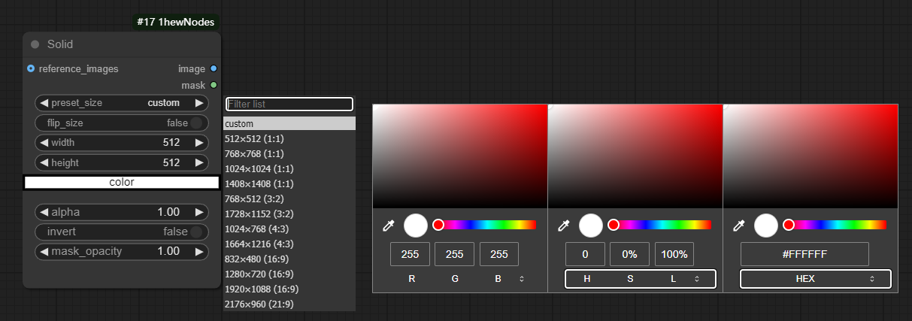
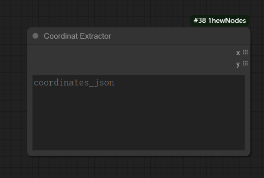

<div align="center">
<a href="./README.md"></a>
<a href="./README.ZH_CN.md"></a>
</div>

# ComfyUI-1hewNodes

这是 ComfyUI 的自定义节点集合，提供了一些实用程序节点。


## 📡 安装

将仓库克隆到 **custom_nodes** 目录中：

```shell
# Clone the repo
git clone https://github.com/1hew/ComfyUI-1hewNodes
```


## 📜 更新

**v1.0.5**

- 添加 `Path Select` 

**v1.0.4**

- 修复 `Image Cropped Paste` 错误，添加批处理功能。


## 😀 节点

### 1. adobe
#### 1.1 Solid（纯色）

> 通过拾色器面板生成纯色图像
>
> 
>
> ==输入==
>
> > reference_image（参考图像）【可选】
> >
> > > 从其他图像节点获取尺寸
> > >
> > > > 使用时，preset_size 和 flip_dimensions 将失效
>
> ==主要参数==
>
> > **preset_size**（预设尺寸）
> >
> > > 支持多种常用尺寸：512×512、768×768、1024×1024等
> > >
> > > 支持自定义尺寸（选择"custom"）
> >
> > **flip_size**（反转尺寸）
> >
> > > 可以快速交换宽度和高度
> >
> > width/height（宽/高）
> >
> > > 自定义宽高尺寸
> >
> > **color**（颜色）
> >
> > > 使用拾色器选择颜色，支持 RGB、HSL、HEX
> >
> > alpha
> >
> > > 控制输出 image 的亮度，范围（0.0-1.0）
> >
> > invert（反转颜色）
> >
> > > 将选择的颜色反转
> >
> > mask_opacity
> >
> > > 控制输出 mask 的亮度，范围（0.0-1.0）

#### 1.2 Luma Matte（亮度蒙版）

> 输入image 根据 输入mask 的亮度显示图像信息
>
> 
>
> ==输入==
>
> > images （图片）【必选】
> >
> > mask（遮罩）【必选】
>
> ==主要参数==
>
> > invert_mask（反转遮罩）
> >
> > > 将输入mask 的黑白信息翻转
> >
> > add_background（添加背景）
> >
> > > 【默认】fales，将输出带透明通道的图片信息
> > >
> > > 设置为 True 时，将只输出 RGB 信息
> >
> > background_color（背景颜色）
> >
> > > add_background 设置为 True 时生效
> > >
> > > 控制透明区域的颜色
> > >
> > > > 支持 0.0-1.0 从 黑色到白色，灰度值（如 "0.5"）
> > > >
> > > > 支持 RGB 格式（如 "255,0,0"）
> > > >
> > > > 支持 HEX 格式（如 "#FF0000"）

#### 1.3 Blend Modes Alpha（混合模式透明度）

> 


### 2. image

#### 2.1 Image Resize Universal（图像调整尺寸）

> 
>
> 当 get_image_size 存在时，则读取 get_image_size 的尺寸
> 当 get_image_size 不存在时，则根据 aspect_ratio 中选项，设置比例

#### 2.2 Image Edit Stitch（图片编辑缝合）

> 
>
> ==输入==
>
> > reference_image（参考图像）【必选】
> >
> > edit_image（编辑图像）【必选】
> >
> > edit_mask（编辑遮罩）【可选】
> >
> > > 当 edit_mask 未设置输入时，输出 mask 的 edit 区域将用白色表示，效果同输出 split_mask
>
> ==输出==
>
> > image
> >
> > > 拼接后的图像
> >
> > mask 
> >
> > > 接后的遮罩
> >
> > split_mask
> >
> > > 得到 referenc区域为黑色，edit 区域为白色的 mask
> > >
> > > > 为 `Image Crop With BBox` 节点提供分割遮罩信息
>
> ==参数==
>
> > position（位置）
> >
> > > 可选位置 [right, left, bottom, top]，
> > >
> > > 默认【right】，表示 edit_image 在 referrnce_image 的右侧
> >
> > match_size（匹配大小）
> >
> > > 【默认】True，当 reference_image 与 edit_image 的尺寸不一致时，会匹配到 edit_image 的尺寸
> >
> > fill_color（填充颜色）
> >
> > > 当 match_size 设置为 True 时生效
> > >
> > > 控制匹配尺寸后，填充区域的颜色，从0到1表示从黑色到白色

#### 2.3  Image Crop Square（图片裁剪方形）

> 
>
> fill_color
>
> > 支持 0.0-1.0 从 黑色到白色，灰度值（如 "0.5"）
> >
> > 支持 RGB 格式（如 "255,0,0"）
> >
> > 支持 HEX 格式（如 "#FF0000"）
> >
> > 支持 e,edge 字符串
> >
> > > 当 apply_mask 为 false 时，四周获取四周上的4个平均颜色
> > >
> > > 当 apply_mask 为 true 是，获取 mask 选择的平均颜色

#### 2.4 Image Crop With BBox （图片裁剪_带检测框）

> 
>
> ==输入==
>
> > image（图像）【必选】
> >
> > mask（遮罩）【必选】
>
> ==输出==
>
> > cropped_image
> >
> > > 裁剪后的图像
> > >
> > > > mask 的白色检测框区域
> >
> > cropped_mask
> >
> > > 裁剪后的遮罩
> >
> > crop_bbox
> >
> > > 输出 裁剪框的信息，用于 `Cropped Image Paste` 节点
>
> ==参数==
>
> > aspect_ratio
> >
> > > 控制输出的比例
> >
> > scale_factor
> >
> > > 调整比例后的尺寸缩放因子
> >
> > extra_padding
> >
> > > 额外扩充像素
> >
> > exceed_image
> >
> > > 是否可以超出原图像尺寸
> > >
> > > > 如果是，超出的部分使用 fill_color 填充
> >
> > invert_mask
> >
> > > 反转输入mask
> >
> > fill_color
> >
> > > 填充颜色
> > >
> > > 支持 0.0-1.0 从 黑色到白色，灰度值（如 "0.5"）
> > >
> > > 支持 RGB 格式（如 "255,0,0"）
> > >
> > > 支持 HEX 格式（如 "#FF0000"）
> > >
> > > 支持 e,edge 字符串
> > >
> > > > 当 apply_mask 为 false 时，四周获取四周上的4个平均颜色
> > > >
> > > > 当 apply_mask 为 true 是，获取 mask 选择的平均颜色
> >
> > dicisible_by
> >
> > > 输出的尺寸可以被 此整数 整除
>
> ==应用==
>
> > ① 将拼接后的图像裁剪输出
> >
> > > 结合 `Image Edit Stitch` 节点效果更佳
> > >
> > > 
> >
> > ② 选取遮罩区域的图像
> >
> > > 

#### 2.5 Image BBox Crop（图像检测框裁剪）

> 

#### 2.6 Image Cropped Paste（图片裁切后拼贴）

> 将 `Image Crop With BBox` 裁剪后的图像，拼接回源图
>
> 
>
> ==输入==
>
> > original_image（源图像）【必选】
> >
> > processed_image（处理后的图像）【必选】
> >
> > crop_bbox（裁剪框的信息）【必选】
> >
> > > 连接 `Image Crop With BBox` 节点中的 crop_bbox 输出【必选】
> >
> > mask（遮罩）【可选】
>
> ==输出==
>
> > pasted_image
> >
> > > 拼贴后的图片
>
> ==参数==
>
> > blend_mode
> >
> > > 混合模式，可选 ["normal", "multiply", "screen", "overlay", "soft_light", "difference"]
> >
> > opacity
> >
> > > 拼贴块的透明度

#### 2.7 Image Blend Modes By CSS （图片混合模式 CSS）

> 

#### 2.8 Image Detail HL Freq Separation（图像细节高低频分离）

> 

#### 2.9 Image Add Label（图像添加标签）

> 为图像添加文本标签，支持上下左右四个方向
>
> 
>
> ==输入==
>
> > image（图像）【必选】
>
> ==输出==
>
> > image
> >
> > > 添加标签后的图像
>
> ==参数==
>
> > height（高度）
> >
> > > 标签区域的高度，默认60像素
> >
> > font_size（字体大小）
> >
> > > 文本字体大小，默认42
> >
> > invert_colors（反转颜色）
> >
> > > 【默认】False，白色文本黑色背景
> > >
> > > 设置为 True 时，黑色文本白色背景
> >
> > font（字体）
> >
> > > 选择字体文件，默认使用 arial.ttf
> >
> > text（文本）
> >
> > > 要显示的文本内容
> >
> > direction（方向）
> >
> > > 标签位置，可选 ["top", "bottom", "left", "right"]
> > >
> > > 默认【top】，表示标签在图像顶部

#### 2.10 Image Plot（图像绘制）

> 
>
> background_color
>
> > 支持 0.0-1.0 从 黑色到白色，灰度值（如 "0.5"）
> >
> > 支持 RGB 格式（如 "255,0,0"）
> >
> > 支持 HEX 格式（如 "#FF0000"）


### 3. mask

#### 3.1 Mask Math Ops（遮罩数学运算）

> 

#### 3.2 Mask Batch Math Ops（遮罩批量数学运算）

> 

#### 3.3 Mask BBox Crop（遮罩检测框裁剪）

> 


### 4. util

#### 4.1 Coordinate Extractor（坐标提取器）

> 从 JSON 格式的坐标数据中提取 x 和 y 坐标列表，用于后续处理。
>
> 

#### 4.2 Slider Value Range Mapping（滑块数值范围映射）

> 

#### 4.3 Path Select（路径选择）

> 


## 🙆 致谢

[ComfyUI](https://github.com/comfyanonymous/ComfyUI)

[ComfyUI-KJNodes](https://github.com/kijai/ComfyUI-KJNodes)

[ComfUI-Easy-Use](https://github.com/yolain/ComfyUI-Easy-Use)

[ComfyUI_LayerStyle](https://github.com/chflame163/ComfyUI_LayerStyle)


## 🌟 星星

感谢慷慨赠送星星的人。

[](https://github.com/1hew/ComfyUI-1hewNodes/stargazers)
