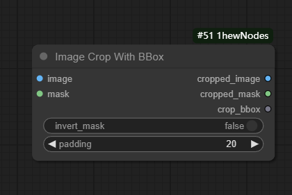

# ComfyUI-1hewNodes

这是一个 ComfyUI 的自定义节点集合，提供了一些实用工具节点。


## 01 | 节点功能

### 1. image
#### 1.1 Solid（纯色）

> 通过拾色器面板生成纯色图像
>
> 
>
> ==输入==
>
> > reference_image（参考图像）【可选】
> >
> > > 从其他图像节点获取尺寸
> > >
> > > > 使用时，preset_size 和 flip_dimensions 将失效
>
> ==主要参数==
>
> > **preset_size**（预设尺寸）
> >
> > > 支持多种常用尺寸：512×512、768×768、1024×1024等
> > >
> > > 支持自定义尺寸（选择"custom"）
> >
> > **flip_size**（反转尺寸）
> >
> > > 可以快速交换宽度和高度
> >
> > width/height（宽/高）
> >
> > > 自定义宽高尺寸
> >
> > **color**（颜色）
> >
> > > 使用拾色器选择颜色，支持 RGB、HSL、HEX
> >
> > alpha
> >
> > > 控制输出 image 的亮度，范围（0.0-1.0）
> >
> > invert（反转颜色）
> >
> > > 将选择的颜色反转
> >
> > mask_opacity
> >
> > > 控制输出 mask 的亮度，范围（0.0-1.0）

#### 1.2 Luma Matte（亮度蒙版）

> 输入image 根据 输入mask 的亮度显示图像信息
>
> 
>
> ==输入==
>
> > images （图片）【必选】
> >
> > mask（遮罩）【必选】
>
> ==主要参数==
>
> > invert_mask（反转遮罩）
> >
> > > 将输入mask 的黑白信息翻转
> >
> > add_background（添加背景）
> >
> > > 【默认】fales，将输出带透明通道的图片信息
> > >
> > > 设置为 True 时，将只输出 RGB 信息
> >
> > background_color（背景颜色）
> >
> > > add_background 设置为 True 时生效
> > >
> > > 控制透明区域的颜色，从0到1表示从黑色到白色

#### 1.3 Image Concatenate（图片拼接）

> 
>
> ==输入==
>
> > reference_image（参考图像）【必选】
> >
> > edit_image（编辑图像）【必选】
> >
> > edit_mask（编辑遮罩）【可选】
> >
> > > 当 edit_mask 未设置输入时，输出 mask 的 edit 区域将用白色表示，效果同输出 split_mask
>
> ==输出==
>
> > image
> >
> > > 拼接后的图像
> >
> > mask 
> >
> > > 接后的遮罩
> >
> > split_mask
> >
> > > 得到 referenc区域为黑色，edit 区域为白色的 mask
> > >
> > > > 为 `Image Crop With BBox` 节点提供分割遮罩信息
>
> ==参数==
>
> > position（位置）
> >
> > > 可选位置 [right, left, bottom, top]，
> > >
> > > 默认【right】，表示 edit_image 在 referrnce_image 的右侧
> >
> > match_size（匹配大小）
> >
> > > 【默认】True，当 reference_image 与 edit_image 的尺寸不一致时，会匹配到 edit_image 的尺寸
> >
> > fill_color（填充颜色）
> >
> > > 当 match_size 设置为 True 时生效
> > >
> > > 控制匹配尺寸后，填充区域的颜色，从0到1表示从黑色到白色

#### 1.4 Image Crop With BBox （图片裁剪_带裁剪边界框）

> 
>
> ==输入==
>
> > image（图像）【必选】
> >
> > mask（遮罩）【必选】
>
> ==输出==
>
> > cropped_image
> >
> > > 裁剪后的图像
> > >
> > > > mask 的白色检测框区域
> >
> > cropped_mask
> >
> > > 裁剪后的遮罩
> >
> > crop_bbox
> >
> > > 输出 裁剪框的信息，用于 `Image Paste` 节点
>
> ==参数==
>
> > invert_mask
> >
> > > 反转输入mask
> >
> > padding
> >
> > > 检测框扩充像素
>
> ==应用==
>
> > ① 将拼接后的图像裁剪输出
> >
> > > 结合 `Image Concatenate` 节点效果更佳
> > >
> > > 
> >
> > ② 选取遮罩区域的图像
> >
> > > 

#### 1.5 Image Paste（图片拼贴）

> 将 `Image Crop With BBox` 裁剪后的图像，拼接回源图
>
> 
>
> ==输入==
>
> > original_image（源图像）【必选】
> >
> > processed_image（处理后的图像）【必选】
> >
> > crop_bbox（裁剪框的信息）【必选】
> >
> > > 连接 `Image Crop With BBox` 节点中的 crop_bbox 输出【必选】
> >
> > mask（遮罩）【可选】
>
> ==输出==
>
> > pasted_image
> >
> > > 拼贴后的图片
>
> ==参数==
>
> > blend_mode
> >
> > > 混合模式，可选 ["normal", "multiply", "screen", "overlay", "soft_light", "difference"]
> >
> > opacity
> >
> > > 拼贴块的透明度

### 2. util
#### 2.1 CoordinateExtractor（坐标提取器）

> 从 JSON 格式的坐标数据中提取 x 和 y 坐标列表，用于后续处理。
>
> 


## 02 | 安装

1. 将此仓库克隆到 ComfyUI 的 `custom_nodes` 目录中：
   ```bash
   cd ComfyUI/custom_nodes
   git clone https://github.com/1hew/ComfyUI-1hewNodes
   ```