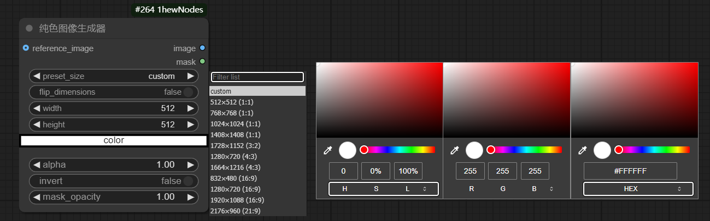
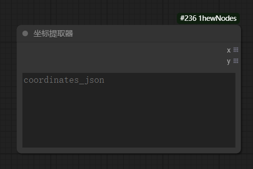

# ComfyUI-1hewNodes

这是一个 ComfyUI 的自定义节点集合，提供了一些实用工具节点。


## 01 | 功能

### 1. 图像节点
#### 1.1 纯色图像生成器 (ColorImageGenerator)

> 通过拾色器面板生成纯色图像
>
> 
>
> ==主要参数==
>
> > **preset_size**（预设尺寸）
> >
> > > 支持多种常用尺寸：512×512、768×768、1024×1024等
> > >
> > > 支持自定义尺寸（选择"custom"）
> >
> > **flip_dimensions**（反转尺寸）
> >
> > > 可以快速交换宽度和高度
> >
> > **color**
> >
> > > 使用拾色器选择颜色，支持 RGB、HSL、HEX
> >
> > alpha（透明度）
> >
> > > 控制输出 image 的亮度，范围（0.0-1.0）
> >
> > invert（反转颜色）
> >
> > > 将选择的颜色反转
> >
> > mask_opacity
> >
> > > 控制输出 mask 的亮度，范围（0.0-1.0）


### 2. 坐标节点
#### 2.1 坐标提取器 (CoordinateExtractor)

> 从 JSON 格式的坐标数据中提取 x 和 y 坐标列表，用于后续处理。
>
> 


## 02 | 安装

1. 将此仓库克隆到 ComfyUI 的 `custom_nodes` 目录中：
   ```bash
   cd ComfyUI/custom_nodes
   git clone https://github.com/1hew/ComfyUI-1hewNodes
   ```